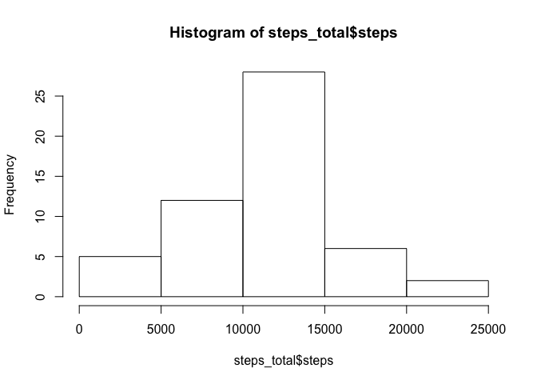
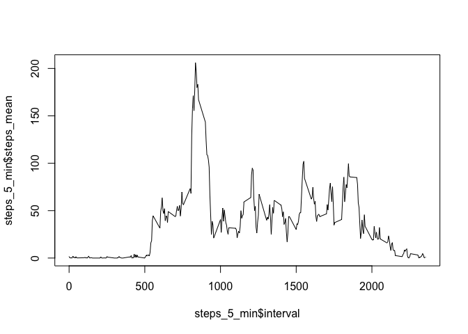
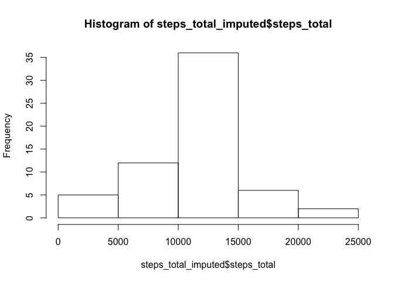
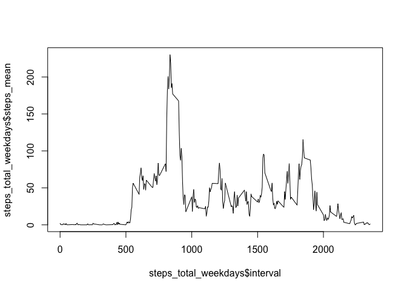
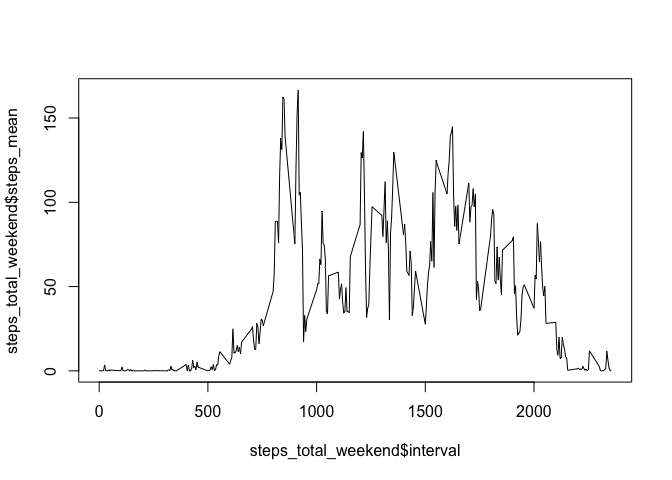

## Loading and preprocessing the data

First the data is read into a data frame and since there are many intervals without a measure,these are then removed. Finally the date column is formatted as such.


```r
activity_data <- read.csv("./activity.csv")

summary(activity_data)
```

```
##      steps                date          interval     
##  Min.   :  0.00   2012-10-01:  288   Min.   :   0.0  
##  1st Qu.:  0.00   2012-10-02:  288   1st Qu.: 588.8  
##  Median :  0.00   2012-10-03:  288   Median :1177.5  
##  Mean   : 37.38   2012-10-04:  288   Mean   :1177.5  
##  3rd Qu.: 12.00   2012-10-05:  288   3rd Qu.:1766.2  
##  Max.   :806.00   2012-10-06:  288   Max.   :2355.0  
##  NA's   :2304     (Other)   :15840
```

```r
activity_data <- activity_data[!is.na(activity_data$steps),] 

activity_data$date <-as.Date(activity_data$date, format = "%Y-%m-%d")
```

## What is mean total number of steps taken per day?

The total number of steps taken per day is first calculated. Then a histogram is made in order to represent the frequencies of the observations.
Finally the mean and the median of the total number of steps taken per day is evaluated.


```r
library(dplyr)
```

```
## 
## Attaching package: 'dplyr'
```

```
## The following objects are masked from 'package:stats':
## 
##     filter, lag
```

```
## The following objects are masked from 'package:base':
## 
##     intersect, setdiff, setequal, union
```

```r
steps_total <- activity_data %>% group_by(date) %>%
  summarise(steps = sum(steps))

hist(steps_total$steps)
```

<!-- -->

```r
mean_steps <- mean(steps_total$steps)
mean_steps
```

```
## [1] 10766.19
```

```r
median_steps <- median(steps_total$steps)
median_steps
```

```
## [1] 10765
```

## What is the average daily activity pattern?

This code first summarises the average number of steps per interval and then plots the resulting output. Finally the interval with the maximum number of steps is printed.


```r
library(dplyr)

steps_5_min <- activity_data %>% group_by(interval) %>%
  summarise(steps_mean = mean(steps))

plot(steps_5_min$interval, steps_5_min$steps_mean, type = "l")
```

<!-- -->

```r
max_steps_5_min <- steps_5_min[steps_5_min$steps_mean == max(steps_5_min$steps_mean),]
max_steps_5_min$interval
```

```
## [1] 835
```


## Imputing missing values

In this part of the analysis the number of missing values is again determined and then the missing values are imputed using the mean per interval. A new data set is created therefore.


```r
missing_values <- sum(is.na(read.csv("./activity.csv")$steps))
missing_values
```

```
## [1] 2304
```

```r
activity_data_na <- read.csv("./activity.csv")[is.na(read.csv("./activity.csv")$steps),]
activity_data_na <- left_join(activity_data_na[, 2:3], steps_5_min, by = "interval")
colnames(activity_data_na)[3] <- "steps"

activity_data_imputed <- rbind(activity_data, activity_data_na)
```

In order to evaluate the impact of the missing values first a histogram of the total number of steps taken per day is created using the imputed data set. Then the mean and the median of the total number of steps is determined.


```r
steps_total_imputed <- activity_data_imputed %>% group_by(date) %>%
  summarise(steps_total = sum(steps))

hist(steps_total_imputed$steps_total)
```

<!-- -->

```r
mean_steps_imputed <- mean(steps_total_imputed$steps_total)
mean_steps_imputed
```

```
## [1] 10766.19
```

```r
median_steps_imputed <- median(steps_total_imputed$steps_total)
median_steps_imputed
```

```
## [1] 10766.19
```

## Are there differences in activity patterns between weekdays and weekends?

The average number of steps taken per interval on weekdays and weekends is calculated and then plotted. 


```r
activity_data_imputed$day <- weekdays(activity_data_imputed$date)
activity_data_imputed$workday <- NA

for(i in 1:length(activity_data_imputed$day)){
  if(activity_data_imputed[i,4] %in% c("Samstag", "Sonntag")){
    activity_data_imputed[i,5] <- "no"
  } else {
        activity_data_imputed[i,5] <- "yes"
  }
}

steps_total_weekdays <- subset(activity_data_imputed, workday == "yes") %>% group_by(interval) %>%
  summarise(steps_mean = mean(steps))

steps_total_weekend <- subset(activity_data_imputed, workday == "no") %>% group_by(interval) %>%
  summarise(steps_mean = mean(steps))

plot(steps_total_weekdays$interval, steps_total_weekdays$steps_mean, type = "l")
```

<!-- -->

```r
plot(steps_total_weekend$interval, steps_total_weekend$steps_mean, type = "l")
```

<!-- -->


